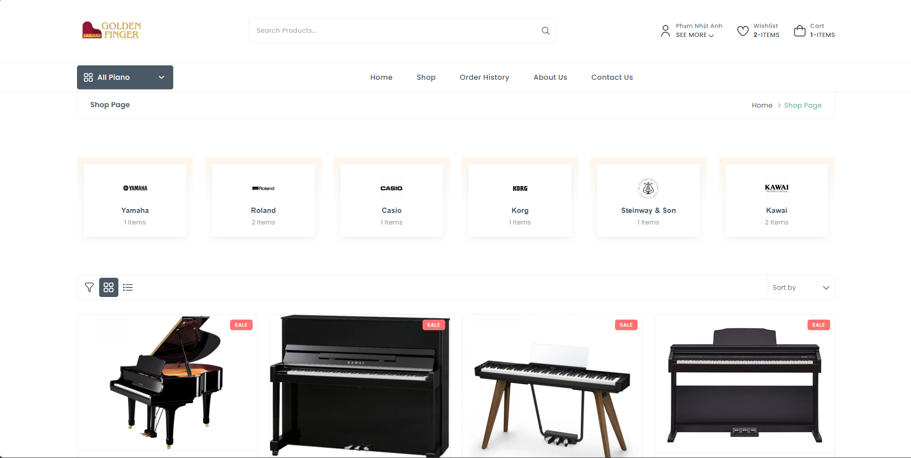
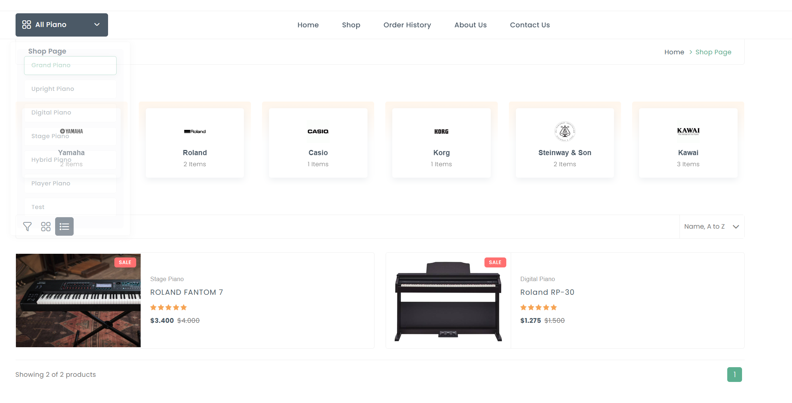
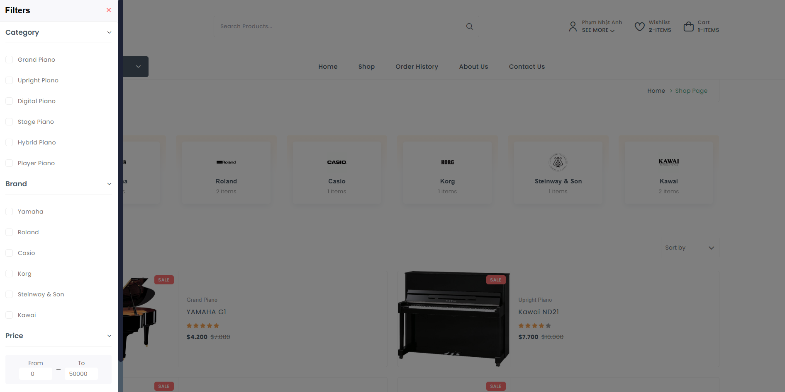

# Golden Finger E-Commerce Platform

<!-- PROJECT SHIELDS -->

[![Contributors][contributors-shield]][contributors-url]
[![Forks][forks-shield]][forks-url]
[![Stargazers][stars-shield]][stars-url]
[![Issues][issues-shield]][issues-url]
[![MIT License][license-shield]][license-url]

<!-- PROJECT LOGO -->
<br />
<div align="center">
  <a href="https://github.com/NhatNhuDinh/Golden-Finger">
    
  </a>

  <h3 align="center">Golden Finger</h3>

  <p align="center">
    A comprehensive e-commerce platform built with Jakarta EE
    <br />
    <br />
    <a href="https://github.com/NhatNhuDinh/Golden-Finger">View Demo</a>
    ·
    <a href="https://github.com/NhatNhuDinh/Golden-Finger/issues">Report Bug</a>
    ·
    <a href="https://github.com/NhatNhuDinh/Golden-Finger/issues">Request Feature</a>
  </p>
</div>

<!-- TABLE OF CONTENTS -->
<details>
  <summary>Table of Contents</summary>
  <ol>
    <li>
      <a href="#about-the-project">About The Project</a>
      <ul>
        <li><a href="#preview-screenshots">Preview Screenshots</a></li>
        <li><a href="#built-with">Built With</a></li>
      </ul>
    </li>
    <li>
      <a href="#getting-started">Getting Started</a>
      <ul>
        <li><a href="#prerequisites">Prerequisites</a></li>
        <li><a href="#installation">Installation</a></li>
        <li><a href="#database-configuration">Database Configuration</a></li>
      </ul>
    </li>
    <li><a href="#features">Features</a></li>
    <li><a href="#project-structure">Project Structure</a></li>
    <li><a href="#user-roles">User Roles</a></li>
    <li><a href="#security-features">Security Features</a></li>
    <li><a href="#contributing">Contributing</a></li>
    <li><a href="#license">License</a></li>
    <li><a href="#Contributors">Contributors</a></li>
  </ol>
</details>

<!-- ABOUT THE PROJECT -->

## About The Project

Golden Finger is a comprehensive e-commerce platform developed with Jakarta EE for my PRJ301 course at FPT University. The platform provides a seamless shopping experience for customers and a powerful management system for administrators, specializing in audio products and musical instruments.

Key highlights:

- Intuitive shopping interface with product filtering and search functionality
- Secure checkout process with multiple payment options including VNPay
- Feature-rich admin dashboard with sales analytics and user management
- Responsive design optimized for both desktop and mobile devices using Tailwind CSS
- Secure authentication and role-based access control
- Wishlist functionality for saving favorite products

<p align="right">(<a href="#readme-top">back to top</a>)</p>

### Preview Screenshots

<div align="center">
  <h4>Home Page</h4>
  
  
  
  <h4>Shop Page</h4>
  
  
  
  
  <h4>Admin Dashboard</h4>
  
</div>

<p align="right">(<a href="#readme-top">back to top</a>)</p>

### Built With

 [![Java][Java.com]][Java-url]
 [![Jakarta EE][JakartaEE.com]][JakartaEE-url]
 [![SQL Server][SQLServer.com]][SQLServer-url]
 [![Bootstrap][Bootstrap.com]][Bootstrap-url]
 [![Tailwind CSS][TailwindCSS.com]][TailwindCSS-url]
 [![jQuery][jQuery.com]][jQuery-url]
 [![ApexCharts][ApexCharts.com]][ApexCharts-url]
 [![VNPay][VNPay.com]][VNPay-url]

<p align="right">(<a href="#readme-top">back to top</a>)</p>

<!-- GETTING STARTED -->

## Getting Started

Follow these steps to set up and run the Golden Finger e-commerce platform locally.

### Prerequisites

- JDK 11 or higher
- Apache Tomcat 10.0 or higher
- SQL Server database
- NetBeans IDE (recommended)

### Installation

1. Clone the repository
   ```sh
   git clone https://github.com/NhatNhuDinh/Golden-Finger.git
   ```
2. Open the project in NetBeans IDE or your preferred Java IDE
3. Build the project using the IDE's built-in tools or with Ant
   ```sh
   ant build
   ```
4. Deploy the WAR file to your Tomcat server
5. Access the application at `http://localhost:8080/GoldenFinger`

### Database Configuration

1. Create a new database in SQL Server named `GoldenFinger`
2. Execute the SQL script `script.sql` located in the root directory to create all required tables and initial data
3. Configure the database connection in `src/java/com/vnpay/common/DBConnect.java`:

```java
// Modify these values to match your SQL Server configuration
private String serverName = "localhost";     // Your SQL Server hostname
private String dbName = "GoldenFinger";      // Database name
private String portNumber = "1433";          // SQL Server port (default is 1433)
private String instance = "";                // Leave empty for default instance
private String userID = "your_username";     // Your SQL Server username
private String password = "your_password";   // Your SQL Server password
```

4. If you're using VNPay for payment, configure the payment settings in `src/java/com/vnpay/common/Config.java`

<p align="right">(<a href="#readme-top">back to top</a>)</p>

<!-- FEATURES -->

## Features

### Customer Features

- **Product Browsing**: Browse audio products with filtering, sorting, and search functionality
- **Shopping Cart**: Add, remove, and update products in cart with real-time total calculation
- **User Authentication**: Register, login, profile management, and password recovery
- **Order Management**: View order history, track current orders, and cancel pending orders
- **Secure Checkout**: Multiple payment options including Cash on Delivery and VNPay integration
- **Wishlist**: Save favorite products for future purchase
- **Responsive Design**: Optimized for both desktop and mobile devices using Tailwind CSS

### Admin Features

- **Dashboard**: Comprehensive overview of sales, customers, and revenue with interactive charts
- **Product Management**: Add, edit, delete products with detailed specifications and multiple images
- **Category Management**: Organize products into categories with hierarchical structure
- **Order Management**: Process orders, update status, and manage shipping information
- **User Management**: Manage customer accounts, view order history, and update account status
- **Analytics**: Track sales performance, top products, and customer behavior with visual reports
- **Supplier Management**: Manage product suppliers and their information

<p align="right">(<a href="#readme-top">back to top</a>)</p>

<!-- PROJECT STRUCTURE -->

## Project Structure

```
GoldenFinger/
├── src/
│   ├── java/
│   │   ├── controller/      # Servlet controllers
│   │   │   ├── admin/       # Admin dashboard controllers
│   │   │   ├── shop/        # Customer-facing controllers
│   │   │   └── user/        # User authentication and profile controllers
│   │   ├── dal/             # Data Access Layer for database operations
│   │   ├── filter/          # Request filters for authentication and security
│   │   ├── model/           # Entity classes for database tables
│   │   └── utils/           # Utility classes including DB connection
│   └── conf/                # Configuration files
├── web/
│   ├── dashboard/           # Admin dashboard JSP pages
│   │   └── assets/          # Admin-specific assets
│   ├── WEB-INF/             # Web application configuration
│   ├── assets/              # Static assets (CSS, JS, images)
│   │   ├── img/             # Images for products and UI
│   │   ├── js/              # JavaScript files including Tailwind
│   │   └── css/             # CSS stylesheets
│   └── *.jsp                # Customer-facing JSP pages
└── lib/                     # External libraries and dependencies
```

<p align="right">(<a href="#readme-top">back to top</a>)</p>

<!-- USER ROLES -->

## User Roles

1. **Customer** (RoleID = 1)

   - Browse and search products
   - Add items to cart and wishlist
   - Place and track orders
   - Manage personal profile and order history
   - Submit reviews and ratings

2. **Admin** (RoleID = 2)
   - Full access to admin dashboard
   - Manage products, categories, and suppliers
   - Process and fulfill customer orders
   - Manage user accounts and access permissions
   - View sales analytics and generate reports
   - Configure system settings

<p align="right">(<a href="#readme-top">back to top</a>)</p>

<!-- SECURITY FEATURES -->

## Security Features

- **Filter-based Authentication**: Secures admin pages and user-specific operations
- **Role-based Access Control**: Different permissions for different user roles
- **Password Hashing**: Secure password storage using modern hashing algorithms
- **Session Management**: Secure handling of user sessions with timeout features
- **Input Validation**: Protection against common web vulnerabilities like XSS and SQL injection
- **HTTPS Support**: Configured for secure communication
- **Secure Payment Processing**: Integration with VNPay for secure transactions
- **Audit Logging**: Tracking of important system events and user actions

<p align="right">(<a href="#readme-top">back to top</a>)</p>

<!-- CONTRIBUTING -->

## Contributing

Contributions are what make the open source community such an amazing place to learn, inspire, and create. Any contributions you make are **greatly appreciated**.

If you have a suggestion that would make this better, please fork the repo and create a pull request. You can also simply open an issue with the tag "enhancement".
Don't forget to give the project a star! Thanks again!

1. Fork the Project
2. Create your Feature Branch (`git checkout -b feature/AmazingFeature`)
3. Commit your Changes (`git commit -m 'Add some AmazingFeature'`)
4. Push to the Branch (`git push origin feature/AmazingFeature`)
5. Open a Pull Request

<p align="right">(<a href="#readme-top">back to top</a>)</p>

<!-- LICENSE -->

## License

Distributed under the MIT License. See `LICENSE.txt` for more information.

<p align="right">(<a href="#readme-top">back to top</a>)</p>

<!-- CONTRIBUTORS -->

## Contributors

<table>
  <tr>
    <td align="center">
      <a href="https://github.com/NhatNhuDinh">
        <br />
        <sub><b>Nhat Nhu Dinh</b></sub>
      </a><br />
      <sub>Chan đê</sub>
    </td>
    <td align="center">
      <a href="https://github.com/kl3inIT">
        <br />
        <sub><b>Phan Hong Dat</b></sub>
      </a><br />
      <sub>dep trai co gi sai</sub>
    </td>
    <td align="center">
      <a href="https://github.com/NhanhAnhXtanh">
        <br />
        <sub><b>Pham Nhat Anh</b></sub>
      </a><br />
      <sub>shark</sub>
    </td>
  </tr>
</table>

<p align="right">(<a href="#readme-top">back to top</a>)</p>

<!-- ACKNOWLEDGMENTS -->

<!-- MARKDOWN LINKS & IMAGES -->
<!-- https://www.markdownguide.org/basic-syntax/#reference-style-links -->

[contributors-shield]: https://img.shields.io/github/contributors/NhatNhuDinh/Golden-Finger.svg?style=for-the-badge
[contributors-url]: https://github.com/NhatNhuDinh/Golden-Finger/graphs/contributors
[forks-shield]: https://img.shields.io/github/forks/NhatNhuDinh/Golden-Finger.svg?style=for-the-badge
[forks-url]: https://github.com/NhatNhuDinh/Golden-Finger/network/members
[stars-shield]: https://img.shields.io/github/stars/NhatNhuDinh/Golden-Finger.svg?style=for-the-badge
[stars-url]: https://github.com/NhatNhuDinh/Golden-Finger/stargazers
[issues-shield]: https://img.shields.io/github/issues/NhatNhuDinh/Golden-Finger.svg?style=for-the-badge
[issues-url]: https://github.com/NhatNhuDinh/Golden-Finger/issues
[license-shield]: https://img.shields.io/github/license/NhatNhuDinh/Golden-Finger.svg?style=for-the-badge
[license-url]: https://github.com/NhatNhuDinh/Golden-Finger/blob/main/LICENSE.txt
[linkedin-shield]: https://img.shields.io/badge/-LinkedIn-black.svg?style=for-the-badge&logo=linkedin&colorB=555
[product-screenshot]: web/assets/img/screenshot.png
[Java.com]: https://img.shields.io/badge/Java-ED8B00?style=for-the-badge&logo=java&logoColor=white
[Java-url]: https://www.oracle.com/java/
[JakartaEE.com]: https://img.shields.io/badge/Jakarta_EE-4A4A55?style=for-the-badge&logo=jakarta-ee&logoColor=white
[JakartaEE-url]: https://jakarta.ee/
[SQLServer.com]: https://img.shields.io/badge/SQL_Server-CC2927?style=for-the-badge&logo=microsoft-sql-server&logoColor=white
[SQLServer-url]: https://www.microsoft.com/en-us/sql-server
[Bootstrap.com]: https://img.shields.io/badge/Bootstrap-563D7C?style=for-the-badge&logo=bootstrap&logoColor=white
[Bootstrap-url]: https://getbootstrap.com
[TailwindCSS.com]: https://img.shields.io/badge/Tailwind_CSS-38B2AC?style=for-the-badge&logo=tailwind-css&logoColor=white
[TailwindCSS-url]: https://tailwindcss.com
[jQuery.com]: https://img.shields.io/badge/jQuery-0769AD?style=for-the-badge&logo=jquery&logoColor=white
[jQuery-url]: https://jquery.com
[ApexCharts.com]: https://img.shields.io/badge/ApexCharts-35495E?style=for-the-badge&logo=chart-dot-js&logoColor=4FC08D
[ApexCharts-url]: https://apexcharts.com/
[VNPay.com]: https://img.shields.io/badge/VNPay-1A73E8?style=for-the-badge&logo=paypal&logoColor=white
[VNPay-url]: https://vnpay.vn/
